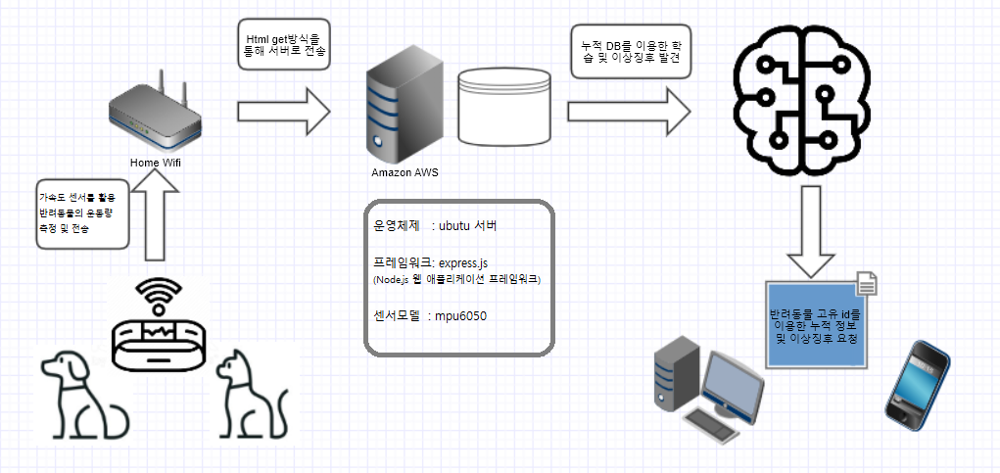
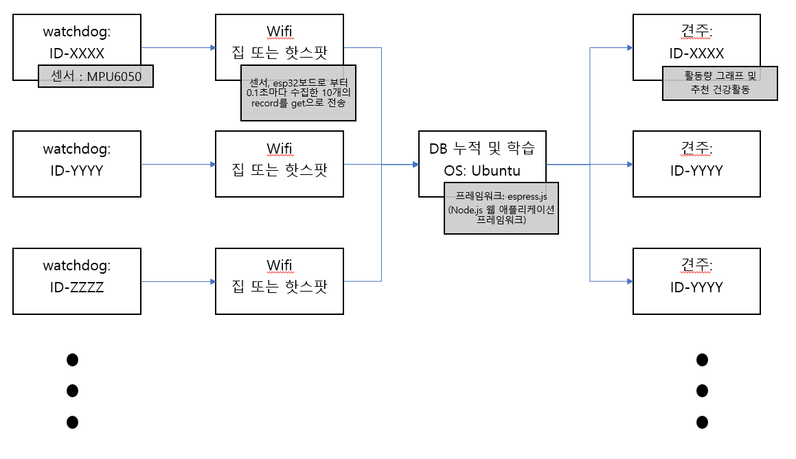

# 프로젝트 소개
---
- **공식 프로젝트명**
    - 웨어러블 센서를 통한 반려동물 건강보조 제품
- **팀명**
    - 현명한집사
- **제품/서비스명(브랜드)**
    - 와치독

# Pain Point, 풀고자 하는 문제
---
- **Pain Point**
    - 현재 우리는 반려동물의 건강을 위해 산책을 시키고 집에서도 운동을 시키는 경우가 있습니다. 하지만 정확하게 얼마만큼의 활동량을 가졌는지 파악하기 어렵습니다. 그래서 하루 적정 활동량을 가졌는지, 평소와 비슷한 활동량을 나타내는지 모르기 때문에 건강을 잘 유지하고 있는지 알기 어렵습니다. 그리고 반려동물이 주인과 떨어져 있을 때 분리불안 증상이 있을까봐 많은 걱정이 있습니다. 마지막으로 반려동물이 자고 일어나는 시간과 그 사이에 건강한 수면을 취하고 있는지 알기 어렵습니다.

- **풀고자 하는 문제**
    - 반려동물의 수명은 10년 이상이라고 합니다. 오랜기간 가족처럼 지낸 반려동물을 떠나보낸다면 마음이 아플 것입니다. 하지만 아무리 신경을 써도 반려동물들은 말을 할 수 없기에 매일 건강을 유지하는지는 확인하기 어렵습니다. 그래서 웨어러블 센서로 반려동물의 운동량을 실시간 측정하여 매일 활동량을 기록하고 모인 데이터를 바탕으로 건강을 유지하고 있는지 분석하려고 합니다. 그리고 반려동물이 주인과 떨어져 있을 때 움직임의 변화를 기록하고 분석하여 분리불안 증세가 있는지 판별하려고 합니다. 마지막으로 반려동물의 자는 시간, 일어나는 시간을 웨어러블 센서로 움직임을 분석하여 차후 수면시간을 예측할 수 있게하고 그 시간동안 건강한 수면을 하고 있는지 분석하여 사용자에게 알려주려고 합니다.

# 어떻게 푸는가?
---
- **반려동물의 운동량 분석을 통한 건강 예측**
  - 반려동물의 하루 운동량을 MPU-6050 가속도 / 자이로 센서를 이용하여 실시간으로 계산합니다. 이후 축적된 운동량 데이터를 사용자가 쉽게 볼 수 있게 그래프로 나타냅니다. 그리고 모인 데이터를 분석하여 반려동물이 건강을 유지하고 있는지 사용자에게 알려줍니다. 데이터 분석은 해당 반려동물의 하루 권장 운동량을 달성했는지, 평소와 큰 차이의 운동량을 나타냈는지 등의 방법을 사용할 예정입니다.

- **반려동물의 분리불안 증세 판별**
  - 우선 반려동물이 주인과 떨어져 있을 때를 알아야합니다. 이를 위하여 주인의 스마트폰과 웨어러블 센서를 블루투스로 연결합니다. 이후 주인이 출근 등으로 반려동물과 거리가 멀어져서 블루투스 연결이 끊겼을 때 반려동물과 분리된 상태로 인지합니다. 이 상태일때 반려동물의 움직임을 웨어러블 센서로 기록합니다. 쌓인 데이터를 주인과 붙어있을 때의 데이터와 비교 분석하여 반려동물이 분리불안 증세를 나타내고 있는지 사용자에게 알려주고 대책을 마련할 수 있게 하려고 합니다.

- **반려동물의 수면 질 예측**
  - 반려동물의 수면 질 예측을 하기 위하여 자는 시간, 일어나는 시간을 알아야 합니다. 이는 웨어러블 센서를 통한 움직임의 변화를 분석하여 수면시간을 예측할 수 있습니다. 그리고 이 수면시간에 잠을 잘 자고 있는지도 일관된 낮은 활동량의 데이터등을 통해 예측을 할 수 있습니다. 이렇게 하루동안 모인 데이터를 분석하여 사용자에게 반려견이 건강한 수면을 취하고 있는지 알려주고 대책을 마련할 수 있게 하려고 합니다.

# (예상)시스템 구성도
---
다음은 빌딩블록을 이용한 시스템 구성도 입니다.
 
<!-- 시스템 구성도 사진 필요 -->
# 기대성과
---
- 반려동물의 건강을 매일 체크할 수 있는것 자체가 주인에게 안심을 줍니다. 그래서 반려동물과 오래 살고 싶은 주인이라면 누구나 쓸만하다고 생각합니다. 그리고 반려동물의 일일 운동량을 그래프로 확인할 수 있어서 혹시나 운동량이 적을때 추가 운동을 통해 건강을 유지시킬 수 있어서 용이하게 사용할 수 있을 것입니다. 그리고 반려동물에게 분리불안이 있는지, 수면은 잘 취하고 있는지 알 수 있어서 사용자의 걱정을 덜어줄 수 있을 것입니다. 만약 문제가 있다면 빠른 조치를 취하게 하여 반려동물의 건강유지에 많은 도움이 될 것입니다.  또한 반려동물을 키우고 싶지만 동물병원에 비용을 쓰기 어려운 저소득 계층에게도 웨어러블 센서가 건강 보조 역할을 해줄 수 있어서 도움이 될 것입니다.

# 기술섹션
---
- **블록다이어그램**
 
- **데이터 수집 위한 Wiring 및 핵심코드설명**
  - Wiring mpu6050 to esp32
    - VCC to 3V3
    - GND to GND
    - SCL to G22
    - SDA to G21
  - 핵심코드소개
    -  mpu6050.update();
  accX = mpu6050.getAccX();
  accY = mpu6050.getAccY();
  accZ = mpu6050.getAccZ();
  calorie = dog_mass * (accX*accX + accY*accY + accZ*accZ) / (200.0 * 4.187);
  sum_100 += calorie;
  if(loop_count%10 == 0){
    sprintf(url, "http://54.146.59.56:8000/data?id=1");  
  }
  sprintf(append_value, "&accX%d=%f&accY%d=%f&accZ%d=%f&cal%d=%f", loop_count%10, accX, loop_count%10, accY, loop_count%10, accZ, loop_count%10, calorie);
  strcat(url, append_value);
  loop_count++;
  - 핵심코드설명
    - 반려동물의 활동량을 실시간으로 체크하기 위하여 1초에 10묶음의 데이터를 자동 와이파이 연결을 통해 http GET 형식으로 보내려고 합니다. 이에 따라 100ms 간격으로 http GET 형식으로 보낼 문자열을 url에 이어 붙입니다. loop_count를 하나씩 늘리며 이 값이 10의 배수가 될때마다 위에서 이어진 url로 http GET 통신을 진행하여 데이터를 DB에 보냅니다. 포함되는 데이터는 id, 3축 가속도, 칼로리 소모량 입니다.
- **센서부터 DB까지 데이터가 이동하는 과정**
  - mpu6050으로 부터 취득한 3축 가속도 데이터와 칼로리 소모량을 http GET 형식으로 DB에 전송합니다. http GET 포맷은 http://server:port/data?id=1&accX0=1.2&accY0=1.2&accZ0=2.3&cal0=0.01&accX1=1.3 ... 으로 총 10묶음의 데이터를 한번에 GET 형식으로 전송합니다. 서버는 amazon을 이용하고 port는 8000번을 사용하고 있습니다. DB의 속성은 id, accX, accY, accZ, cal, time으로 구성되어 있습니다. id는 반려동물의 고유 번호이며 accX, accY, accZ는 3축 가속도 정보입니다. 그리고 cal은 칼로리 소모량이며 time은 데이터가 전송된 시간입니다. 즉, 센서로부터 넘어온 데이터는 'mpu6050'이라는 데이터베이스의 acc(id, accX, accY, accZ, cal, time)의 테이블에 저장이 됩니다. 추가적으로 데이터를 그래프화 할 때 많은 데이터로 인한 버벅임을 해결하기 위하여 1초동안, 10초동안 소모한 칼로리를 합한 acc_10(id, cal_10, time), acc_100(id, cal_100, time) 테이블도 추가로 생성하여 관리중입니다.
- **머신러닝 계획**
  - 반려동물이 주인과 같이 있을때의 활동량이 안정된 상태임을 머신러닝을 통하여 학습시킵니다. 이후 반려동물이 주인과 떨어져 있을때의 활동량을 머신러닝을 통해 안정된 상태인지, 불안정한 상태인지 판단할 수 있도록 활용하려고 합니다.
- **분석결과를 사용자에게 보여주는 방법**
  - 데이터 분석 결과는 웹을 통하여 그래프를 인용한 설명으로 사용자에게 보여주려고 합니다.

# Teams
---
- **류인석**
 
    - 팀장, 발표, 아두이노 센서 데이터 기록, 설문조사, 판넬제작
- **임호종**
 
    - Committer, 프로젝트 DB 구축, 운동량 계산, 건강상태 분석, 그래프 요소등 구상
- **강우석**
 
    - 데이터 수집, 웨어러블 제품 제작, 브라우저상 그래프 설계, md파일 관리, 수익모델 구상

# 개발환경
---
- **사용도구**
  - **github** : pull request를 활용한 agile 개발
    - pull request의 구체적 절차 : committer의 repository를 fork 합니다. 이후 복사된 repository에서 파일을 수정합니다. 그리고 깃허브 상단바의 Pull requests에 들어가서 New pull request를 클릭합니다. 마지막으로 Create pull request를 눌러서 committer에게 merge 요청을 보냅니다.
  - **slack** : github과 연동으로 pull request, 업데이트시 실시간 정보 알림 및 공유
  - **Arduino** : 센서 데이터 수집 및 서버에 데이터 전송
  - **putty** : 서버에 센서 데이터 저장 및 분석
- **마일스톤**
    1. *2020-04-06 ~ 2020-04-19*
        - 프로젝트 아이디어에 대해 세부적인 계획까지 완성
    2. *2020-04-20 ~ 2020-05-10*
        - 프로젝트 DB 구축, 센서 데이터로 운동량 계산 후 건강상태 분석
    3. *2020-05-11 ~ 2020-05-24*
        - 브라우저상 그래프 설계 및 웨어러블 제품 제작
    4. *2020-05-25 ~ 2020-06-07*
        - 제품 테스트 및 데모데이 준비
